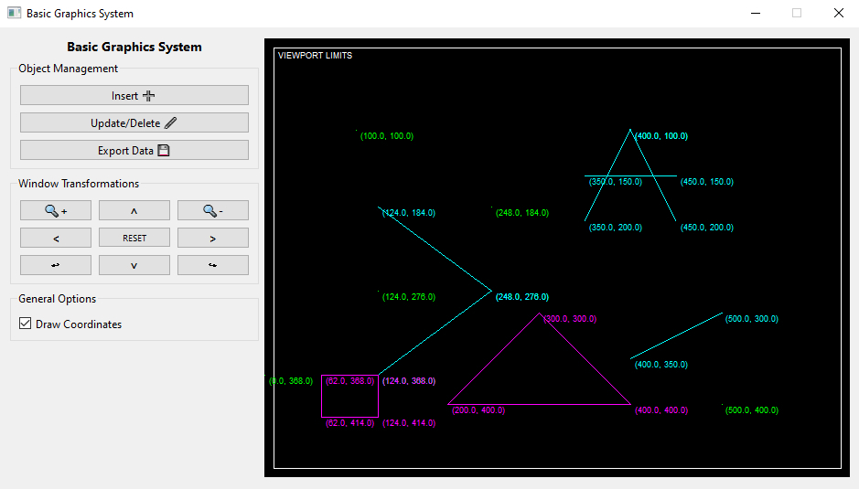

# Basic Graphics System

  

  
  
  

[PT-BR Version](./README_pt_BR.md)

A basic graphics system created with Python and PySide6.

<kbd>
  
</kbd>

## Table of Contents

- [Basic Graphics System](#basic-graphics-system)
  * [Introduction](#introduction)
  * [Table of Contents](#table-of-contents)
  * [Features](#features)
    + [Window To Viewport Transformation](#window-to-viewport-transformation)
    + [XML File (Input)](#xml-file--input-)
    + [Feature X](#feature-x)
  * [Running](#running)
    + [Prerequisites](#prerequisites)
    + [Commands](#commands)

## Introduction

This Python program is a solution for what is requested in the pratical works of the Computer Graphics module of the Computer Science course at IFNMG.

The program reads a XML file containing data of the viewport and objects to be drawn, and performs a coordinate transformation for each object, mapping the object's original window-coordinate to a viewport-coordinate.

<!-- TODO - Add more detailed introduction. -->
*Section under construction...*

## Features

### Window To Viewport Transformation

To better understanding of window-to-viewport transformation, check the following explanation:

> "Window to Viewport Transformation is the process of transforming 2D world-coordinate objects to device coordinates. Objects inside the world or clipping window are mapped to the viewport which is the area on the screen where world coordinates are mapped to be displayed." - [Geeks For Geeks](https://www.geeksforgeeks.org/window-to-viewport-transformation-in-computer-graphics-with-implementation/)

<!-- TODO - Add more detailed features description. -->
*Section under construction...*

### XML File (Input)

The input file already has some data defined. New data can be added if desired. The only requirement is that the `<viewport>` and `<window>` elements must keep the same format, and can only have their attribute values changed. Also, these two elements must be at the beginning of the XML root `<data>` tag, in the same original order.

<!-- TODO - Add more detailed features description. -->
*Section under construction...*

### Feature X

<!-- TODO - Add more detailed features description. -->
*Section under construction...*

## Running

### Prerequisites

- Python 3.10 or further version installed;
- A terminal with access to Python;
- PySide6 installed. You can install it running `pip install pyside6==6.2.0` in the terminal;
- NumPy installed. You can install it running `pip install numpy` in the terminal.

### Commands

Run `py src/main.py` or `python src/main.py` in the terminal.

When using the argument `-n` or `--new-file`, the program will read the alternate XML input file (only available if the objects data have been exported previously in the program).

The output file containing the viewport-coordinate of each object can be found in `data/output/viewport-coordinates.xml`.

A window with the rendered objects will open.

<!-- TODO - Improve commands description. -->
*Section under construction...*
