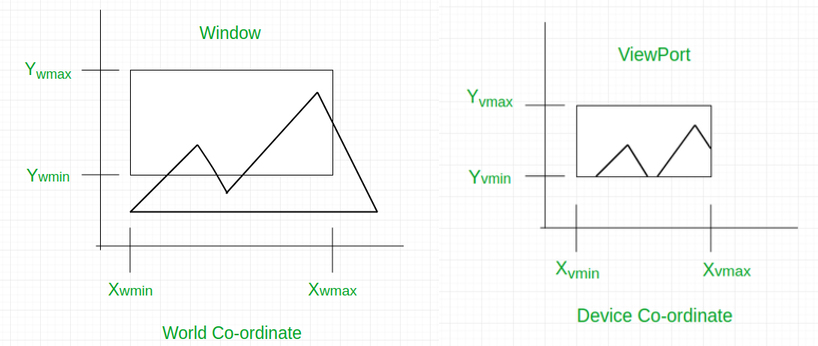

# Window To Viewport Mapper

[English Version](./README.md)

## Introdução

Este programa em Python é uma solução para o que é solicitado no [Trabalho Prático 1](./docs/TP1.pdf) do módulo de Computação Gráfica do curso de Ciência da Computação do IFNMG.

O programa lê um arquivo XML contendo dados do viewport e dos objetos a serem desenhados, e realiza um transformação de coordenadas para cada objeto, mapeando as coordenadas de janela originais do objeto para coordenadas de viewport.

### Transformação Window-Viewport

Para entender melhor to que se trata a transformação window-viewport, leia a seguinte explicação:

> "A transformação de Window-Viewport é o processo de transformar/mapear as coordenadas de mundo de objetos 2D para coordenadas de dispositivo. Objetos dentro do mundo ou janela de "clippagem"/corte são mapeados para o viewport, que é a área da tela onde as coordenadas de mundo são mapeadas para serem exibidas." - [Geeks For Geeks](https://www.geeksforgeeks.org/window-to-viewport-transformation-in-computer-graphics-with-implementation/)

## Executando

### Pré-requisitos

- Python 3.10 ou versão posterior instalado;
- Algum terminal com acesso ao Python.

### Comandos

Execute `py src/main.py` ou `python src/main.py` no terminal.

O arquivo de saída contendo as coordenadas de viewport de cada objeto pode ser encontrado em `data/output/viewport-coordinates.xml`.

## Arquivo XML (Entrada)

O arquivo de entrada já possui alguns dados definidos. Novos dados podem ser adicionados se desejado. O único requisito é que os elementos `<viewport>` e `<window>` devem manter o mesmo formato, podendo ter apenas os valores de seus atributos alterados. Além disso, esses dois elementos devem ficar no início da tag root `<dados>` do XML, na mesma ordem original.
