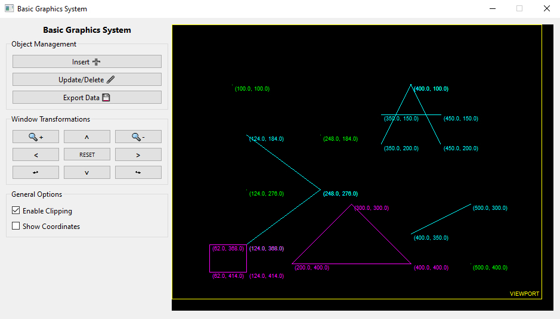

# Basic Graphics System

  

  
  
  

[English Version](./README.md)

Um sistema gráfico básico criado com Python e PySide6.

<kbd>
  
</kbd>

## Conteúdo

- [Basic Graphics System](#basic-graphics-system)
  * [Conteúdo](#conte-do)
  * [Introdução](#introdu--o)
  * [Funcionalidades](#funcionalidades)
    + [Transformação Window-Viewport](#transforma--o-window-viewport)
    + [Arquivo XML (Entrada)](#arquivo-xml--entrada-)
    + [Feature X](#feature-x)
  * [Executando](#executando)
    + [Pré-requisitos](#pr--requisitos)
    + [Comandos](#comandos)

## Introdução

Este programa em Python é uma solução para o que é solicitado nos trabalhos práticos do módulo de Computação Gráfica do curso de Ciência da Computação do IFNMG.

O programa lê um arquivo XML contendo dados do viewport e dos objetos a serem desenhados, e realiza um transformação de coordenadas para cada objeto, mapeando as coordenadas de janela originais do objeto para coordenadas de viewport.

<!-- TODO - Add more detailed introduction. -->
*Seção em construção...*

## Funcionalidades

### Transformação Window-Viewport

Para entender melhor to que se trata a transformação window-viewport, leia a seguinte explicação:

> "A transformação de Window-Viewport é o processo de transformar/mapear as coordenadas de mundo de objetos 2D para coordenadas de dispositivo. Objetos dentro do mundo ou janela de "clippagem"/corte são mapeados para o viewport, que é a área da tela onde as coordenadas de mundo são mapeadas para serem exibidas." - [Geeks For Geeks](https://www.geeksforgeeks.org/window-to-viewport-transformation-in-computer-graphics-with-implementation/)

<!-- TODO - Add more detailed features description. -->
*Seção em construção...*

### Arquivo XML (Entrada)

O arquivo de entrada já possui alguns dados definidos. Novos dados podem ser adicionados se desejado. O único requisito é que os elementos `<viewport>` e `<window>` devem manter o mesmo formato, podendo ter apenas os valores de seus atributos alterados. Além disso, esses dois elementos devem ficar no início da tag root `<dados>` do XML, na mesma ordem original.

<!-- TODO - Add more detailed features description. -->
*Seção em construção...*

### Feature X

<!-- TODO - Add more detailed features description. -->
*Seção em construção...*

## Executando

### Pré-requisitos

- Python 3.10 ou versão posterior instalado;
- Algum terminal com acesso ao Python;
- PySide6 instalado. Você pode instalá-lo executando `pip install pyside6==6.2.0` no terminal.

### Comandos

Execute `py src/main.py` ou `python src/main.py` no terminal.

Ao utilizar o argumento `-n` ou `--new-file`, o programa lerá o arquivo de entrada XML alternativo (apenas disponível se os dados dos objectos foram exportados anteriormente no programa).

O arquivo de saída contendo as coordenadas de viewport de cada objeto pode ser encontrado em `data/output/viewport-coordinates.xml`.

Uma janela com os objetos renderizados será aberta.

<!-- TODO - Improve commands description. -->
*Seção em construção...*
